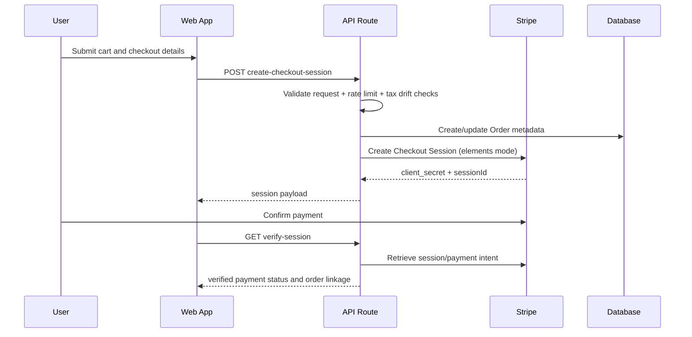

# Payments and Stripe

## Scope

This page documents checkout, verification, refunds, disputes, webhook processing, and operational controls for Stripe.

## Payment Surface Map

| Capability | Primary Path |
|---|---|
| Checkout session creation | `apps/web/app/api/payments/create-checkout-session/route.ts` |
| Session verification | `apps/web/app/api/payments/verify-session/route.ts` |
| Tax calculation | `apps/web/app/api/payments/calculate-tax/route.ts` |
| Catering deposit sessions | `apps/web/app/api/payments/create-catering-deposit-session/route.ts` |
| Admin refunds/disputes | `apps/admin/app/api/admin/payments/*` |

## Checkout Sequence

## Security and Hardening

1. Signature verification is required for webhook ingress.
2. Duplicate suppression uses in-memory TTL and persisted event checks.
3. Rate limiting is enforced per IP (`WEBHOOK_RATE_LIMIT_PER_MINUTE`, default 100/min).
4. Optional IP allowlisting is supported for Stripe webhook sources.

## Data Contracts

- Payment transaction records: `PaymentTransaction` in [packages/database/prisma/schema.prisma](../packages/database/prisma/schema.prisma)
- Event persistence/audit: `IntegrationEvent`
- Dispute lifecycle: admin payment dispute routes under [apps/admin/app/api/admin/payments/disputes](../apps/admin/app/api/admin/payments/disputes)

## Operational Checks

- `npm run test:payments:coverage` (80% threshold)
- `npm run test:payments:integration -- --checkout-event-id <evt> --dispute-event-id <evt> --api-base-url <url>`
- `npm run report:payments:integration`

## Failure Modes to Watch

- Authenticated checkout with missing Stripe customer mapping.
- Payment intent/order linkage drift.
- Webhook replay events processed twice due to dedupe config regressions.
- Refund spikes or dispute-rate threshold breaches.

## Source Anchors

- [docs/STRIPE-FEATURES.md](../docs/STRIPE-FEATURES.md)
- [docs/STRIPE-IMPLEMENTATION-COMPLETE.md](../docs/STRIPE-IMPLEMENTATION-COMPLETE.md)
- [apps/api/src/index.ts](../apps/api/src/index.ts)
